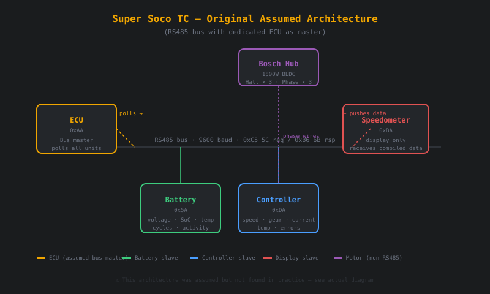
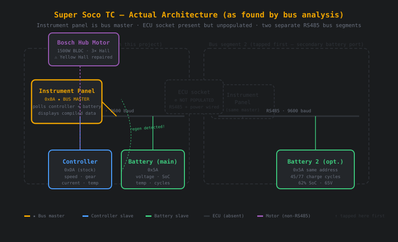
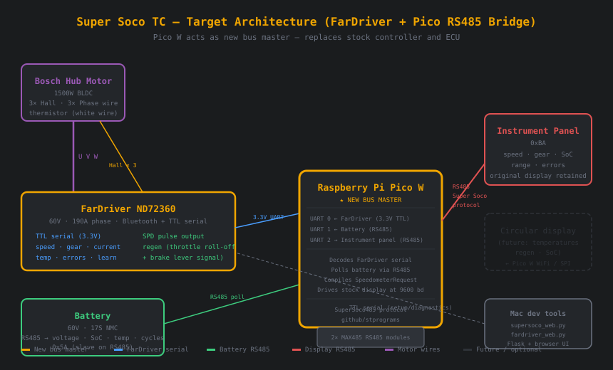

# Super Soco TC — Controller Conversion & RS485 Bridge

> **Goal:** Replace the stock motor controller with a tunable FarDriver ND72360 to enable regenerative braking, and build a Raspberry Pi Pico W bridge that keeps the original instrument panel working via the Super Soco RS485 protocol.

*Inspired by / adapted from:*
- https://github.com/stprograms/SuperSoco485Monitor
- https://github.com/stprograms/SuperSoco485
- https://github.com/jackhumbert/fardriver-controllers
- https://github.com/bobecek79/ESP32-Fardriver-BLE-Reader

---

## Background

A 2021 Super Soco TC started throwing a **motor failure (engine failure) warning** at sustained maximum speed. After a 20-minute cool-down the bike would restart, pointing to a thermal shutdown. The stock controller provides no way to tune thermal limits, reduce phase current, or enable regenerative braking.

**First problem discovered along the way:** the motor had stopped working entirely — traced to a faulty Hall sensor (yellow channel, 100Ω short to GND) in the Bosch hub motor, plus a rotated sensor after reassembly. Error code **E96** (Hall sensor error). Fixed by repair and careful reassembly.

**Primary goal:** replace the stock controller with a FarDriver ND72360 to:
- Enable regenerative braking (stock system has none — or so we thought; see §Discoveries)
- Tune phase current limits to prevent thermal overload
- Gain telemetry visibility into motor and battery state

---

## What we built

| File | Description |
|---|---|
| `supersoco_monitor.py` | Terminal-based RS485 monitor (rich dashboard) |
| `supersoco_web.py` | **Web-based** RS485 monitor (Flask + SSE, no tkinter) |
| `fardriver_web.py` | **Web-based** FarDriver diagnostic + settings tool |
| `fardriver_tool.py` | (legacy) tkinter version of FarDriver tool |

### Running the tools

```bash
pip install flask pyserial

# Monitor the Super Soco RS485 bus live:
python3 supersoco_web.py --port /dev/tty.usbserial-AK04P0KB

# Replay a saved raw binary capture:
python3 supersoco_web.py --replay ride.bin

# FarDriver diagnostic + settings (connect via 3.3V TTL serial):
python3 fardriver_web.py --port /dev/tty.usbserial-AK04P0KB

# All tools open at http://localhost:5000
# If AirPlay Receiver occupies port 5000:
python3 supersoco_web.py --webport 5001
```

---

## System architecture

### What we assumed (original model)



The protocol documentation (SuperSoco485Monitor repo) describes four units on a single RS485 bus: an **ECU (0xAA)** acting as bus master polling the controller, battery, and speedometer. The ECU compiles data and pushes a SpeedometerRequest packet to the display.

### What we actually found



**The ECU socket is physically present on the bike but unpopulated.** No ECU is connected. Instead, the **instrument panel (0xBA) itself is the bus master** — it polls the controller and battery directly and displays the data without any intermediary.

Additionally, the tap point used first turned out to be a **secondary battery port** (separate RS485 segment for an optional second battery), not the main bus. The controller traffic appeared on this segment too, because the instrument panel broadcasts across both.

Key discovery from live bus capture:

```
[21:50:58] CTRL RSP  Gear=3  Speed=28.1km/h  Current=0.0A
[21:50:59] BATTERY RSP  65V  SoC=62%  Current=0A  Activity=charging   ← regen!
[21:50:59] CTRL REQ  charging=yes                                       ← ECU signals regen
```

**The stock Super Soco TC does have regenerative braking** — it activates on throttle roll-off above ~28 km/h. The battery reports `Activity=charging` and the controller request switches to `charging=yes`. This was not previously documented publicly for this model.

### Target architecture (in progress)



The Pico W bridge sits between the FarDriver, battery, and instrument panel:
- **UART 0:** reads FarDriver telemetry (speed, gear, current, temp, errors) via 3.3V TTL serial
- **UART 1:** polls battery via RS485 (existing Super Soco protocol, 9600 baud)
- **UART 2:** acts as bus master toward the instrument panel, sending SpeedometerRequest telegrams compiled from the above data

The stock display is retained unchanged. A future circular touchscreen could be added via Pico W WiFi or SPI for temperature and regen display.

---

## Key discoveries

### 1. Bus master is the instrument panel, not an ECU
The ECU socket on the TC wiring harness is populated with RS485 and power wires but no ECU board is fitted. The instrument panel acts as master, polling `0xDA` (controller) and `0x5A` (battery) directly.

### 2. Regenerative braking exists in the stock TC
Bus capture during a deceleration run showed the battery switching to `Activity=charging` and the controller request byte switching to `charging=yes` at speeds above ~28 km/h on throttle roll-off. Battery current goes negative (charging) during this phase.

### 3. Speed factor correction
The SuperSoco485Monitor C# source uses a speed factor of `0.028` for ControllerResponse telegrams. Empirical data from a live ride (controller reporting ~11.6 km/h, actual speedometer showing 45 km/h) gives a corrected factor of **`0.109`**.

### 4. Hall sensor orientation matters
After disassembling the Bosch hub motor, the yellow Hall sensor PCB was reinstalled with a slightly different angular orientation relative to the other two. This caused the motor to run erratically (backwards, jerky, error E96) even after the electrical fault was repaired. The fix was to carefully match the original angular position of all three sensors on the PCB.

### 5. Open-collector Hall outputs need pull-ups
The three Hall signal wires are open-collector outputs. Pull-up resistors live on the **controller side**, not on the motor PCB. The yellow channel's 100Ω short to GND was enough to defeat the pull-up and prevent the signal from reaching the supply rail.

### 6. Battery terminal corrosion caused no-start
A dull grey (oxidised) terminal on one battery connector was causing a high-resistance junction. At low current draw (lights, controller boot) the bike appeared to start. Under the higher current demand of motor startup, the voltage drop across the corroded joint was sufficient to trigger BMS protection. Fix: clean with 600-grit sandpaper, apply dielectric grease.

### 7. FarDriver baud rate is 9600, not 115200
The FarDriver controller's TTL serial header (labelled "USB" on the housing, but is a 3.3V UART — **do not connect 5V**) operates at **9600 baud**, confirmed by logic analyser measurement. The PC app auto-detects, so no reference baud rate is documented by FarDriver officially.

---

## Hardware notes

### FarDriver ND72360
- **Voltage:** 48–72V (run at 60V with stock battery)
- **Phase current:** 190A peak
- **Position sensor:** 120° Hall (option 0 in app)
- **Bluetooth:** built-in (BLE, device name `YQxxx`)
- **Serial:** 3.3V TTL, 4-pin header, 9600 baud — **Pin 1 (3.3V supply) must NOT be connected**
- **Self-learn command:** `AA C6 A0 A0 88 02 45 0E` (verified against CRC tables from jackhumbert repo)
- **Factory reset:**    `AA C6 A0 A0 88 08 C5 09` (CRC cross-verified)
- **First run minimum wiring:** battery + 3× phase + Hall connector (6-wire) + throttle (3-wire) + brake signal

### Bosch Hub Motor
- OEM unit for Super Soco TC, not available as a catalog part
- 1500W nominal / 3500W peak / 150Nm peak torque
- 12" outrunner BLDC
- 6-wire Hall connector: +5V, GND, Yellow, Blue, Green (signals), White (thermistor)
- Hall sensors are open-collector; pull-ups on controller side

### RS485 bus
- Protocol: `[type_hi][type_lo][dst][src][pdu_len][pdu...][checksum][0x0D]`
- Request type: `0xC5 0x5C` · Response type: `0xB6 0x6B`
- Checksum: XOR of `pdu_len` and all PDU bytes
- Baud: 9600, 8N1
- Unit addresses: ECU `0xAA`, Controller `0xDA`, Battery `0x5A`, Speedo `0xBA`
- 4-pin JST SM connector under seat (A+/A− for one segment, B+/B− for second battery segment)

---

## FarDriver protocol notes

Protocol documented at https://github.com/jackhumbert/fardriver-controllers

- CRC: two-table algorithm, init `a=0x3C, b=0x7F`
- Packet structure: `0xAA [0xC0+len] [addr] [addr] [data...] [crc_a] [crc_b]`
- Message length: 16 bytes for status messages
- Key addresses:
  - `0xE2`: gear, direction, motion, fault flags, speed raw, modulation
  - `0xE8`: bus voltage, line current
  - `0xF4`: motor temperature, battery SoC
  - `0xD6`: MosFET temp, auto-learn state, hall position error, phase lost
  - `0xA0`: model name + system commands
  - `0xCA`: angle learn status (0xAA = learned, 0x55 = learning)
  - `0x12`: rated voltage, rated power, pole pairs
  - `0x30`: regen stop current, max regen current

---

## Next steps

- [ ] Pico W bridge firmware (MicroPython): read FarDriver serial + poll battery + emit SpeedometerRequest
- [ ] Ignition switch wiring (replace remote/key system with simple barrel switch)
- [ ] FarDriver self-learn run (wheel off ground, TTL serial connected)
- [ ] Tune phase current limits to prevent thermal overload at sustained speed
- [ ] Test regen braking with FarDriver (configure StopBackCurr and MaxBackCurr)
- [ ] Optional: circular touchscreen for temperature + regen display via Pico W WiFi

---

## Resources

| Resource | Description |
|---|---|
| [SuperSoco485Monitor](https://github.com/stprograms/SuperSoco485Monitor) | C# RS485 protocol sniffer and decoder — source of the packet format and address table used here |
| [SuperSoco485](https://github.com/stprograms/SuperSoco485) | Arduino library for the Super Soco RS485 protocol |
| [jackhumbert/fardriver-controllers](https://github.com/jackhumbert/fardriver-controllers) | FarDriver serial protocol: CRC tables, address map, system commands, 30-pin wiring diagram |
| [bobecek79/ESP32-Fardriver-BLE-Reader](https://github.com/bobecek79/ESP32-Fardriver-BLE-Reader) | ESP32 BLE reader for FarDriver — GATT service UUIDs and BLE packet format |
| [Endless Sphere: FarDriver thread](https://endless-sphere.com/sphere/threads/nanjing-fardriver-controllers.99183/) | Community megathread: tuning, wiring, self-learn, ND72360 builds |
| [SiAECOSYS FarDriver parameter guide](https://siaecosys.com) | English-language parameter description for FarDriver app — all settings explained |
| [supersocoforum.com](https://supersocoforum.com) | Super Soco community forum — TC-specific builds and documented issues |

---

*Project by Edwin · University of Twente / FabLab Oldenzaal · 2024–2025*